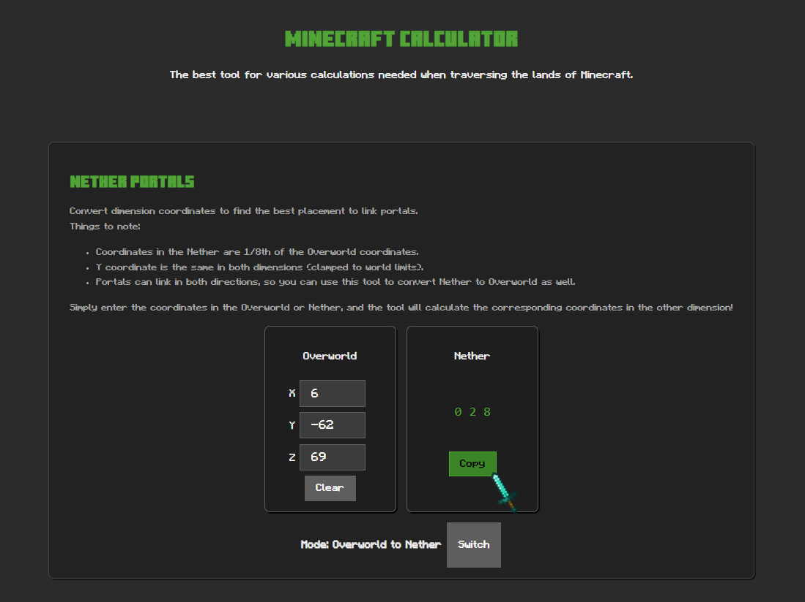
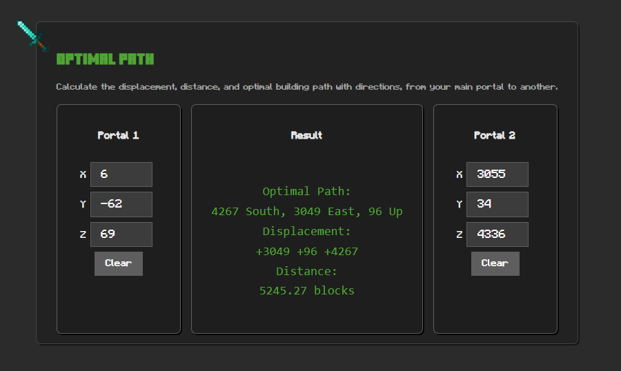

# Minecraft Calculator

_A web app dedicated to essential Minecraft calculations such as Nether portal coordinates and optimal point-to-point path._

### [Use It Here ↗](https://MateuszS6.github.io/Minecraft-Calculator/)

## Overview

Minecraft Calculator is a lightweight web app that provides essential Minecraft utilities—such as Nether portal coordinate conversion and optimal point-to-point pathfinding. It’s built with plain HTML, CSS, and JavaScript for fast, offline-friendly use and easy embedding on static pages. Ideal for players who want quick, accurate in-game calculations without installing mods.

## Stack

## Images

### Portal Coordinates Conversion

### Optimal Path Calculation

## Status

> v1.0 complete. Feel free to browse through the repository.
